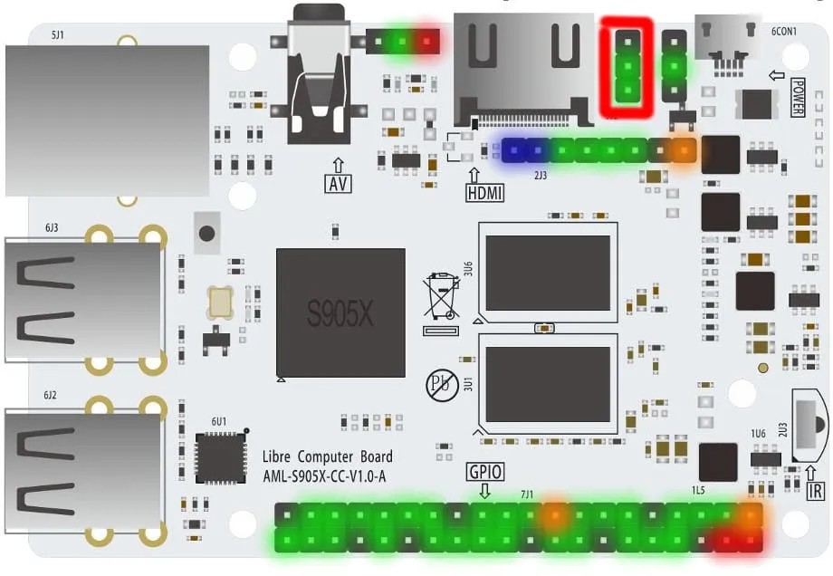

# POTATO JUCE:

## Setup:
```
./pi-deps.sh
```
[Source](https://github.com/juce-framework/JUCE/blob/master/docs/Linux%20Dependencies.md)

## Build

Building *should* be as easy as:
```
./build.sh
```

## Run
Running *should* be as easy as:
```
./run.sh
```

## Juce Lib Included?
This is because its not easy to get Projucer running on ARM and its easier to do it this way than to to depend on Projucer to setup the project correctly. 
# Le Potato


 - Amlogic S905X SoC
        - 4 ARM Cortex-A53 @ 1.512GHz
             - Cryptography Extension
         - 2G + 3P ARM Mali-450 @ 750MHz
             - OpenGL ES 1.1 / 2.0
             - OpenVG 1.1
         - Amlogic Video Engine 10
             - Decoders
                 - VP9 P2 4K60
                 - H.265 MP10 @L5.1 4K60
                 - H.264 HP @L5.1 4K30
                J - PEG / MJPEG
             - Encoders
                 - H.264 1080P60
                 - JPEG
     - Up to 2GB DDR3 SDRAM
     - 4 USB 2.0 Type A
     - 100 Mb Fast Ethernet
     - 3.5mm TRRS AV Jack
     - HDMI 2.0
     - MicroUSB Power In
     - MicroSD Card Slot
     - eMMC Interface
     - IR Receiver
     - U-Boot Button
     - 40 Pin Low Speed Header (PWM, I2C, SPI, GPIO)
     - Audio Headers (I2S, ADC, SPDIF)
     - UART Header


## External Docs

Le Potato Specs:
https://www.libre.computer/products/aml-s905x-cc/

GPIO Getting Started:
https://docs.google.com/presentation/d/1u4Z7c7he3sVfFC5laRgGkQSrsFML22xEOw6-r-VxeQM/edit#slide=id.g3b43f356f0_9_0

GPIO Headers:
https://docs.google.com/spreadsheets/d/1U3z0Gb8HUEfCIMkvqzmhMpJfzRqjPXq7mFLC-hvbKlE/edit#gid=0
