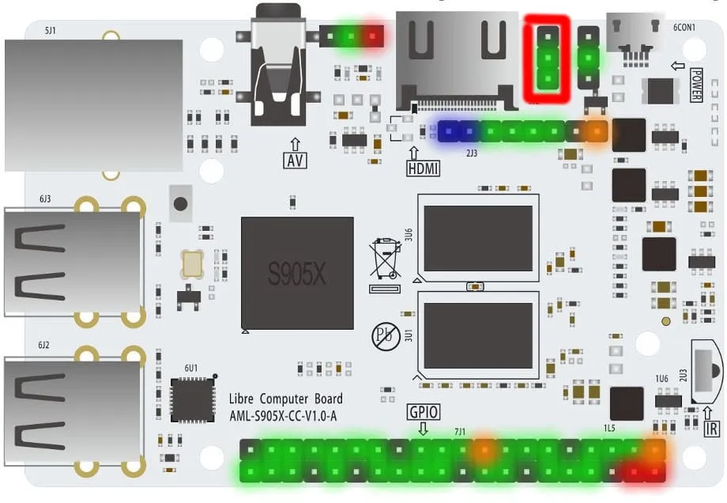

# GPIO
[Source](https://developer.technexion.com/docs/using-gpio-from-a-linux-shell)
## Overview


- Green - GPIO (General)
- Red - 5v
- Orange - 3.3v
- Blue - ADC
- Dark - Ground

## CLI Usage

### Install `gpiod`
```
sudo apt install gpiod
```

## Detect GPIO Chips
```
gpiodetect
```

Example:
```
$ gpiodetect
gpiochip0 [aobus-banks] (11 lines)
gpiochip1 [periphs-banks] (100 lines)
```

## List Lines
```
gpioinfo
```

Example:
```
$ gpioinfo
gpiochip0 - 11 lines:
	line   0:    "UART TX"       unused   input  active-high 
	line   1:    "UART RX"       unused   input  active-high 
	line   2:   "Blue LED" "librecomputer:blue" output active-high [used]
	line   3: "SDCard Voltage Switch" "VCC_CARD" output active-high [used]
	line   4: "7J1 Header Pin5" unused input active-high 
	line   5: "7J1 Header Pin3" unused input active-high 
	line   6: "7J1 Header Pin12" unused input active-high 
	line   7:      "IR In"       unused   input  active-high 
	line   8: "9J3 Switch HDMI CEC/7J1 Header " unused input active-high 
	line   9: "7J1 Header Pin13" unused input active-high 
	line  10: "7J1 Header Pin15" unused output active-high 
gpiochip1 - 100 lines:
	line   0:      unnamed       unused   input  active-high 
	line   1:      unnamed       unused   input  active-high 
	line   2:      unnamed       unused   input  active-high 
	line   3:      unnamed       unused   input  active-high 
	line   4:      unnamed       unused   input  active-high
    ...
```

You can reference the [official doc](https://docs.google.com/spreadsheets/d/1U3z0Gb8HUEfCIMkvqzmhMpJfzRqjPXq7mFLC-hvbKlE/edit#gid=0) to find the pin you want to use and then use a `grep` to find the line you want. 

For example, if we want to find **Pin8** from that doc we could do this:
```
$ gpioinfo | grep Pin8
	line  91: "7J1 Header Pin8" unused output active-high 
```

That lets us know that the line number for that pin is **91**. 

### Get Pins
```
gpioget <chipNumber> <lineNumber>
```

Example:
```
gpioget gpiochip1 91
```

You can also omit the `gpiochip` part:
```
gpioget 1 91
```

### Set Pins
```
gpioset <chipNumber> <lineNumber>=<bool>
```

Example:
```
## Set the pin off
gpioset gpiochip1 91=0

## Set the pin on
gpioset gpiochip1 91=1
```

**Note: The `gpiochip` prefix can be omitted here as well.** 

## Controlling GPIO via C++/Python
The Libre Computer dev has written a tutorial on this:
[tutorial link](https://hub.libre.computer/t/how-to-control-gpio-via-python-3/601)

### General Control
> libgpiod is the preferred C interface to interact with the Linux kernel’s GPIO subsystem. Every one of our boards feature GPIOs that can be controlled through this interface. It is well supported, stable, reliable, and well designed.
> 
> GPIOs are organized into banks. These banks can be different voltages. The Linux pinctrl subsystem controls the operations of these GPIO banks. The Linux pinctrl subsystem organizes and exposes these banks to userspace as /dev/gpiochipX where a gpiochip can be a composite of multiple banks and individual GPIOs as lines.
> 
> Our libretech-wiring-tool offers a handy utility called lgpio. It allows you to quickly lookup the chip and line number of a specific pin on a specific header.

```
lgpio info HEADER PIN
```

> Most of our boards feature a primary header so you can also leave out the header if you are looking up with pin number on the primary header.

```
lgpio info PIN
```

> For example, we can lookup pin 3 on AML-S905X-CC Le Potato:
```
$ lgpio info 3
Chip    Line    sysfs   Name    Pad     Ref     Desc
0       5       506     GPIOAO_5        D13     I2C_SDA_AO      I2C_SDA_AO // I2C_SLAVE_SDA_AO // UART_RX_AO_B
```

> This provides us with all the fields of that pin. The fields are described as follows:
```
    Chip - the gpio chip number for libgpiod - /dev/gpiochipX
    Line - the gpio line number on the chip for libgpiod
    sysfs - the legacy gpio number for the deprecated sysfs interface - /sys/class/gpio
    Name - SoC GPIO name
    Pad - SoC physical pad
    Ref - Schematic Reference Name
    Desc - Pin Multiplex Functions
```

> If all we care about is controlling the GPIOs via libgpiod, we can run the following to give us the chip and line numbers respectively:

```
$ lgpio info 3 gpiod
0       5
```